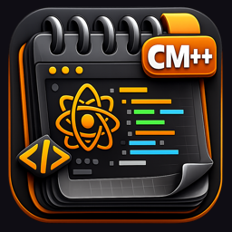

# CodeMac++ Mobile

  

<h2 align="center">CodeMac++ Mobile</h2>

  A native iOS/iPadOS code editor built with Swift and Core Text. 
  By Antonio Scognamiglio

  
  
  
  
  
  
  

  

---

## Download

**[Download CodeMac++ Mobile on the App Store](https://apps.apple.com/app/id6761269270)**

Requires iOS 26+ / iPadOS 26+.

---

## Features

- **Custom Core Text rendering engine** — instant loading of large files, 60fps scrolling
- **Syntax highlighting** for 31 languages (10 with tree-sitter AST parsing)
- **AI integration** — Claude, OpenAI, Google Gemini (bring your own API key)
- **AI Chat panel** — persistent conversation history with code insert/replace
- **7 AI actions** — Explain, Refactor, Fix, Document, Optimize, Test, Generate Code
- **Find & Replace** with regex support
- **Auto-complete** — keywords and code snippets for 16 languages
- **6 built-in themes** — One Dark, Midnight, Ocean, Forest, Light, Sunset
- **Code folding** — collapse/expand blocks with tap
- **Bracket pair colorization** — 6 colors per nesting level
- **Bracket matching** and indent guides
- **Line bookmarks** — double-tap to mark lines
- **File browser** — sidebar with project folders
- **File templates** — 22 predefined templates for quick start
- **Web preview** — live HTML/CSS/JS preview with 500ms debounce
- **Line operations** — sort, deduplicate, join, reverse, trim
- **Diff viewer** — side-by-side file comparison
- **Markdown preview** — live rendered preview
- **Hex viewer** — binary file inspection
- **PDF export** — syntax-highlighted code export with line numbers
- **Function navigator** — jump to functions, classes, structs
- **iPad split view** — file tree sidebar
- **Multi-window** — open multiple editor windows on iPad
- **15+ keyboard shortcuts** for external keyboards
- **Keyboard accessory bar** — 30+ programming symbols
- **Spotlight search** — find files from iOS search
- **Handoff** — continue editing on another device
- **Home screen widget** — recent files (small, medium, large)
- **Live Activities** — Dynamic Island progress for AI requests
- **iCloud sync** — settings synchronized across devices
- **Word wrap**, line numbers, auto-close brackets, auto-indent
- **Context menu** — cut, copy, paste, select all, AI actions
- **Drag & drop** — move text within editor, drop files from Files.app

### Supported Languages

**Tree-sitter (AST):** Python, JavaScript, TypeScript, JSON, C, Go, Rust, HTML, CSS, Ruby

**Regex:** Swift, C++, Objective-C, Java, Kotlin, Dart, PHP, Lua, Perl, R, SQL, Shell, YAML, XML, Markdown, TOML, Dockerfile, Makefile, Gitignore, FortiOS, Plain Text

---

## Privacy

CodeMac++ Mobile does not collect any personal data. AI features are opt-in and require your own API key.

See the full [Privacy Policy](PRIVACY_POLICY.md).

---

## Support

For issues or feedback, please open an [issue](https://github.com/dindonio/codemac-mobile-release/issues).

---

  Copyright © 2026 Antonio Scognamiglio. All rights reserved.

