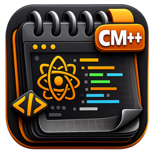

  

<h1 align="center">CodeMac++</h1>

  <strong>Code Editor for iOS / iPadOS</strong>

  
  
  
  

---

**CodeMac++** is a native, high-performance code editor for iPhone and iPad, built from scratch with Core Text rendering engine. Designed for developers who need a powerful, fast, and beautiful coding environment on the go.

## Features

### Editor
- **Core Text rendering** — Custom UIView with CTLine rendering for maximum performance on large files
- **31 languages** — Syntax highlighting with regex + tree-sitter AST for 10 languages
- **6 themes** — One Dark, Midnight, Ocean, Forest, Light, Sunset with animated transitions
- **Auto-complete** — Keywords and snippets for 16 languages
- **Find & Replace** — With regex support
- **Bracket matching** — Visual highlight of matching brackets
- **Indent guides** — Subtle vertical lines at indentation levels
- **Word wrap** — Optional soft wrapping
- **Line numbers** — Configurable gutter

### AI Assistant (BYOK)
- **3 providers** — Claude (Anthropic), OpenAI, Google Gemini
- **7 actions** — Explain, Refactor, Fix, Document, Optimize, Test, Generate
- **Chat panel** — Persistent conversation history with code insert/replace
- **Privacy-first** — Bring Your Own API Key, stored in iOS Keychain
- **Dynamic Island** — Live Activity shows AI request progress

### iPad
- **Split view** — Sidebar with document list + full editor
- **Multi-window** — Open multiple editor windows
- **Keyboard shortcuts** — 15+ shortcuts (Cmd+N/O/S/F/G/W/P/I and more)
- **Keyboard accessory bar** — 30+ programming symbols + arrow keys

### Tools
- **Diff viewer** — Side-by-side file comparison
- **Markdown preview** — Live rendered preview with dark theme
- **Hex viewer** — Binary file inspection
- **PDF export** — Syntax-highlighted code export
- **Function list** — Jump to functions, classes, structs

### Integration
- **Spotlight** — Find your files from iOS search
- **Handoff** — Continue editing on another device
- **Widgets** — Recent files widget for home screen
- **iCloud sync** — Settings synchronized across devices

## Supported Languages

**Tree-sitter (AST):** Python, JavaScript, TypeScript, JSON, C, Go, Rust, HTML, CSS, Ruby

**Regex:** Swift, C++, Objective-C, Java, Kotlin, Dart, PHP, Lua, Perl, R, SQL, Shell, YAML, XML, Markdown, TOML, Dockerfile, Makefile, Gitignore, FortiOS, Plain Text

## Requirements

- iOS 26.0 / iPadOS 26.0 or later
- iPhone or iPad

## Download

<!-- Coming soon to the App Store -->

  <em>Coming soon to the App Store</em>

## Privacy

CodeMac++ does not collect any user data. AI features are opt-in and use your own API keys (BYOK). API keys are stored securely in iOS Keychain and never transmitted to our servers.

## Credits

Built by **Antonio Scognamiglio**

Copyright &copy; 2026 Antonio Scognamiglio. All rights reserved.
